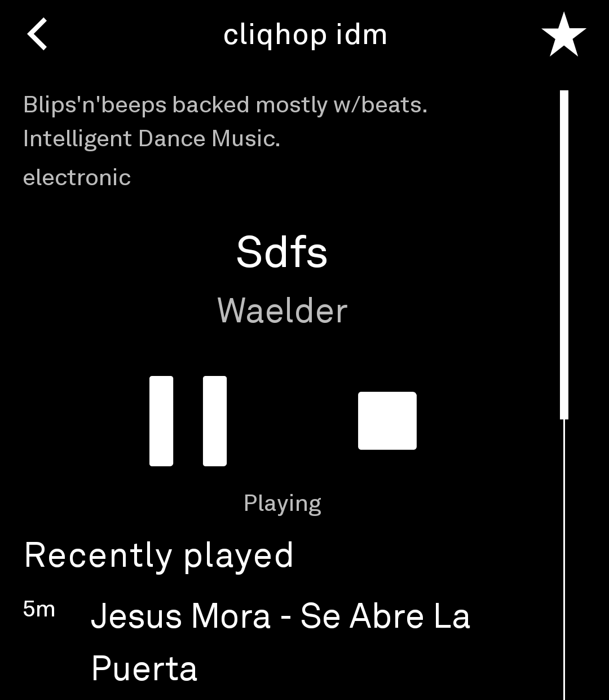

# SomaStreamer

A standalone [Light Phone III](https://www.thelightphone.com/) tool for listening
to [SomaFM](https://somafm.com/), the listener-supported, commercial-free internet
radio stations. You can browse the stations, star your favorites, see what's
playing and what has played since you tuned in, and keep listening after you close
the tool. It is a thin, self-contained repo built against the upstream **Light
SDK**, so it drops straight into Light's tool build and review pipeline.

> **Unofficial.** SomaStreamer is not affiliated with SomaFM. It plays the public
> stream playlists SomaFM publishes for media players, and doesn't use SomaFM's
> API, which is closed to third parties. If you enjoy the stations, consider
> [supporting SomaFM](https://somafm.com/support/).



## Layout

```
somastreamer/
├── light-sdk/            # git submodule → lightphone/light-sdk (pinned commit)
├── scripts/
│   └── update-stations.py  # regenerates Stations.kt from somafm.com/listen/
├── tool/                 # the ONLY dev-owned module
│   ├── lighttool.toml    # tool id, label, version, permissions, capabilities
│   ├── build.gradle.kts
│   └── src/main/kotlin/io/github/tthayer/somastreamer/**.kt
├── settings.gradle.kts   # grafts the submodule's SDK projects into this build
├── build.gradle.kts      # thin root: plugin classpath + ext build knobs
├── gradle.properties
└── gradlew, gradle/      # wrapper (matches the pinned SDK)
```

| File | Role |
|---|---|
| `Stations.kt` | The bundled station list (generated; don't edit by hand) |
| `SomaApi.kt` | Ktor client: `.pls` resolution, and reading the current track from a stream |
| `SomaStreams.kt` | `.pls` parsing, picking a playlist for a stream quality, parsing ICY titles |
| `SongLog.kt` | Tracks heard on each station since it was tuned, newest first (in memory) |
| `RadioPlayer.kt` | Process-level engine over a **detached** `LightAudioPlayer`: tune, pause, stop, mirror fallback |
| `HomeScreen.kt` | Entry screen: now playing, favorites, all stations; settings button in the top bar |
| `SettingsScreen.kt` | Stream quality, and an about line pointing at SomaFM |
| `StationScreen.kt` | A station: description, current track, play/pause/stop, favorite, recently played |
| `SomaPreferences.kt` | DataStore: quality, favorites, and the last-tuned station |

## How it uses SomaFM

| Feature | Call |
|---|---|
| Stations | None: the list ships with the tool (see below) |
| Stream | `GET https://somafm.com/{id}{32,64,130}.pls` for the chosen quality, then play its `File1=` Icecast URL |
| Now playing | Opens the station's 32k stream with `Icy-MetaData: 1`, reads up to the first metadata block (~45 KB), and hangs up. Every 30s while a station screen is open |

The station list comes from the "AAC PLS (SSL)" links on
https://somafm.com/listen/, which SomaFM publishes for media players. When SomaFM
adds or renames a station, regenerate it and ship a new version:

```bash
python3 scripts/update-stations.py
```

The quality setting (Low 32k / Standard 64k / High 128k, Standard by default)
picks one of the three AAC playlists. The platform player can't read `.pls`
itself, so the tool resolves it into the mirror URLs (`ice1`, `ice2`, ...). If a
mirror fails with a network error, the next one is tried before an error is shown.

### Now playing and recently played

SomaFM's play-history feed is part of its closed API, so the tool reads the track
from the stream itself: Icecast puts a `StreamTitle='Artist - Title'` block into
the audio every `icy-metaint` bytes. The SDK's audio player doesn't expose those
blocks, so the station screen makes its own short connection to read one. There's
no album, and "Recently played" lists only the tracks the tool has seen since you
tuned in, while a station screen was open. It resets when you tune to a different
station or the tool's process ends.

## Privacy

The tool has no analytics, no tracking, no ads, and no account. It talks only to
SomaFM: the requests in the table above go straight from the phone to SomaFM's
servers, which see your IP address and a `SomaStreamer` user agent, as any
listener's player would. Nothing else leaves the device. Your favorites, stream
quality, and last-tuned station are stored locally on the phone.

## Playback

Playback uses the SDK's **detached** audio mode (`capabilities = ["detached-audio"]`
in `lighttool.toml`), so the stream keeps playing after the tool is closed and shows
up in the system media controls. When the tool is reopened it reconnects to the
running session and labels it with the last station it tuned. Pausing and resuming
re-queues the stream, which puts you back at the live edge instead of replaying a
stale buffer. **Stop** ends the detached session.

## Building locally

Requires JDK 17 and an Android SDK (`sdk.dir` in `local.properties`).

```bash
git clone --recurse-submodules https://github.com/tthayer/somastreamer.git
./gradlew :tool:testDebugUnitTest :tool:assembleDebug
# → tool/build/outputs/apk/debug/tool-debug.apk
```

The APK is signed with the shared Light dev keystore (from the submodule) for
local sideloading. For the LightOS emulator, build with `-PwithEmulator` and set
`serverPackage = "com.thelightphone.sdk.emulator"` in `tool/lighttool.toml` locally
(don't commit it).

## Bumping the SDK

```bash
git -C light-sdk fetch origin
git -C light-sdk checkout <commit-or-tag>
git add light-sdk && git commit -m "bump light-sdk to <ref>"
```

## Releases (CI)

`.github/workflows/release.yml` (inherited from music-app and skylight-app) cuts a
GitHub Release on every merge to `main`. It derives the version from conventional
commits and attaches a dev-signed release APK, `somastreamer-<tag>.apk`.

## License

MIT. See [LICENSE](LICENSE).
